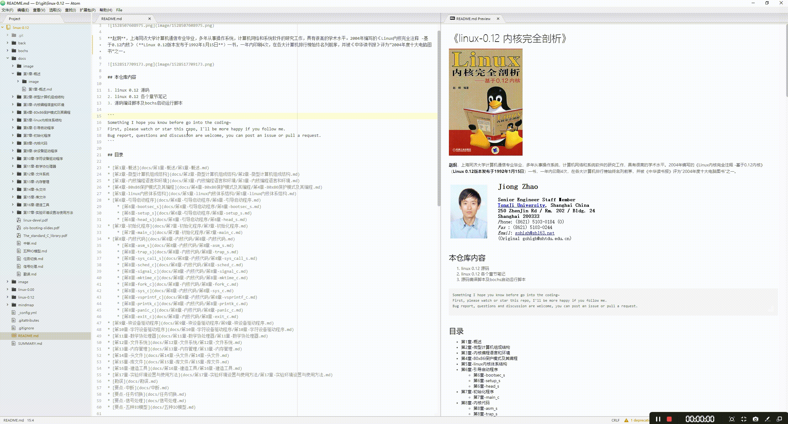

# markdown-preview-auto-open-close


## 本仓库说明

Atom 插件：Atom Markdown 自动开启/关闭预览

开启/关闭 Markdown 文件时自动开启/关闭预览功能(Automatically turn on/off preview when opening/closing Markdown files)

```
Something I hope you know before go into the coding~
* First, please watch or star this repo, I'll be more happy if you follow me.
* Bug report, questions and discussion are welcome, you can post an issue or pull a request.
```


## 使用方法

1. 安装插件
2. 任意打开MD文件，自动右侧生成预览
3. 关闭已打开的MD文件，自动关闭对应文件右侧预览

## 截图演示



## 特性

1. 功能简单的一匹
2. 参考的仓库几年没更新，对目前 Atom 版本支持贼尴尬

## 注意

1. 必须关闭 “Allow Pending Pane Items”
  - 在核心功能设置中有。本插件在启动时自动关闭
  - 如果你非要用这个功能咋办？无解
2. 关闭拼写检查。
  - 在Atom默认安装包“speel check”中。本插件在启动时自动关闭
  - 只是避免了 Atom 本地化错误提示而已，看着心烦。


## 参考

* <https://github.com/brainFade/atom-markdown-auto-preview>
